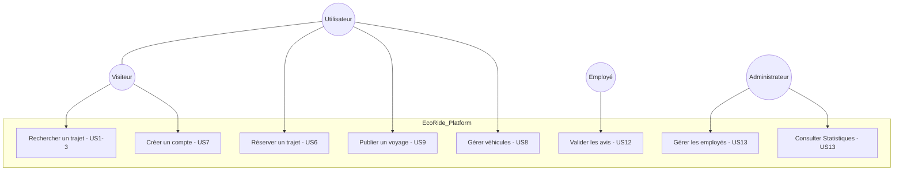
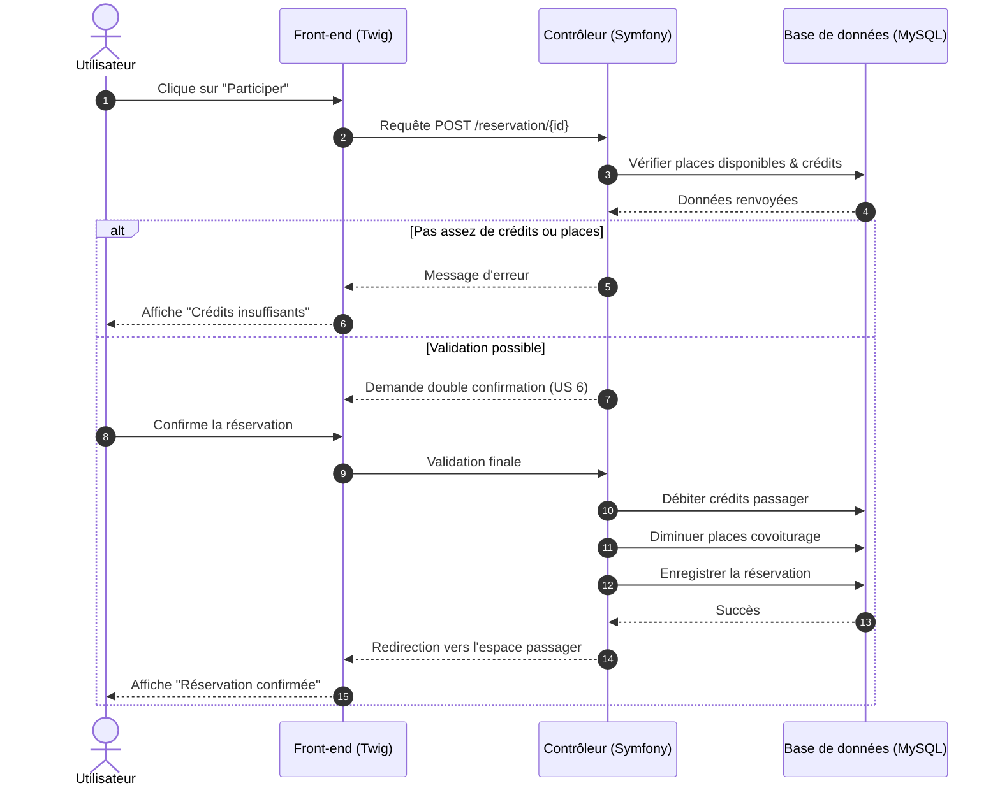

## Diagramme de Cas d'Utilisation (UML)

## Diagramme de Séquence : Réservation (US 6)

## Diagramme de Classe
```mermaid
classDiagram
    class User {
        -int id
        -string email
        -array roles
        -string password
        -string nom
        -string prenom
        -int credit
        -bool isSuspended
        +getRoles() array
        +getNoteMoyenne() float
        +addCovoiturage(Covoiturage c)
    }

    class Covoiturage {
        -int id
        -DateTime date_depart
        -string lieu_depart
        -int nb_place
        -float prix_personne
        -string statut
        -int duree
        +getDuree() int
        +setStatut(string s)
    }

    class Voiture {
        -int id
        -string modele
        -string immatriculation
        -string energie
        -int nbPlaces
        -bool fumeur
        -bool animaux
        +isFumeur() bool
    }

    class Marque {
        -int id
        -string libelle
        +getLibelle() string
    }

    class Avis {
        -int id
        -string commentaire
        -string note
        -string statut
        +setStatut(string s)
    }

    class Configuration {
        -int id
        +getParametres() Collection
    }

    class Parametre {
        -int id
        -string propriete
        -string valeur
    }

    
    User "1" -- "*" Voiture : possède[cite: 6, 7]
    User "1" -- "*" Configuration : gère[cite: 6, 2]
    User "*" -- "*" Covoiturage : participe/organise[cite: 6, 3]
    User "*" -- "*" Avis : laisse/reçoit[cite: 6, 8]
    Voiture "1" -- "*" Covoiturage : est utilisée pour[cite: 7, 3]
    Marque "1" -- "*" Voiture : fabrique[cite: 4, 7]
    Configuration "1" -- "*" Parametre : contient[cite: 2, 5]
```
