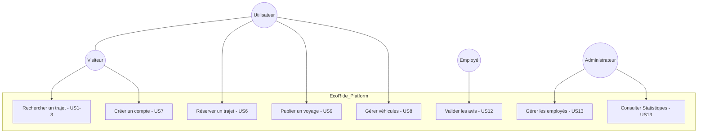
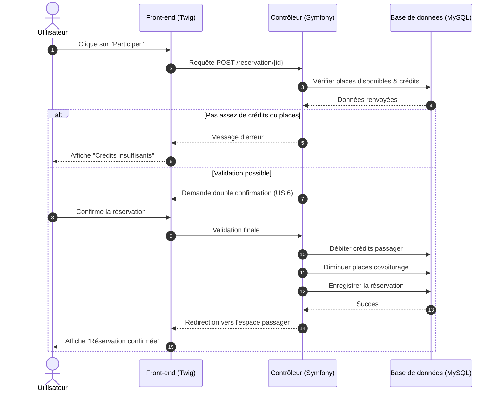

## Diagramme de Cas d'Utilisation (UML)

```mermaid
graph TD
    %% Acteurs
    Visiteur((Visiteur))
    Utilisateur((Utilisateur))
    Employe((Employé))
    Admin((Administrateur))

    subgraph EcoRide_Platform
        UC1[Rechercher un trajet - US1-3]
        UC2[Créer un compte - US7]
        UC3[Réserver un trajet - US6]
        UC4[Publier un voyage - US9]
        UC5[Gérer véhicules - US8]
        UC6[Valider les avis - US12]
        UC7[Gérer les employés - US13]
        UC8[Consulter Statistiques - US13]
    end

    %% Relations Visiteur
    Visiteur --> UC1
    Visiteur --> UC2
    
    %% Héritage : l'Utilisateur peut faire tout ce que le visiteur fait
    Utilisateur --- Visiteur
    Utilisateur --> UC3
    Utilisateur --> UC4
    Utilisateur --> UC5
    
    %% Employé
    Employe --> UC6
    
    %% Admin
    Admin --> UC7
    Admin --> UC8
```
## Diagramme de Séquence : Réservation (US 6)

```mermaid
sequenceDiagram
    autonumber
    actor U as Utilisateur
    participant F as Front-end (Twig)
    participant C as Contrôleur (Symfony)
    participant B as Base de données (MySQL)

    U->>F: Clique sur "Participer"
    F->>C: Requête POST /reservation/{id}
    
    C->>B: Vérifier places disponibles & crédits
    B-->>C: Données renvoyées
    
    alt Pas assez de crédits ou places
        C-->>F: Message d'erreur
        F-->>U: Affiche "Crédits insuffisants"
    else Validation possible
        C-->>F: Demande double confirmation (US 6)
        U->>F: Confirme la réservation
        F->>C: Validation finale
        
        C->>B: Débiter crédits passager
        C->>B: Diminuer places covoiturage
        C->>B: Enregistrer la réservation
        B-->>C: Succès
        
        C-->>F: Redirection vers l'espace passager
        F-->>U: Affiche "Réservation confirmée"
    end
```
